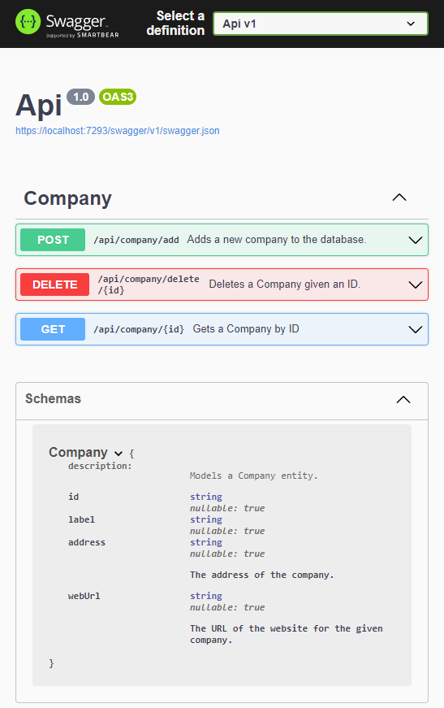
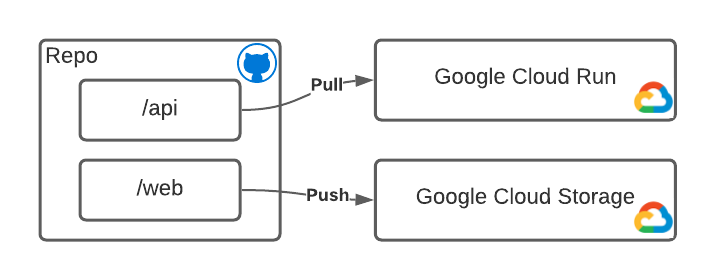
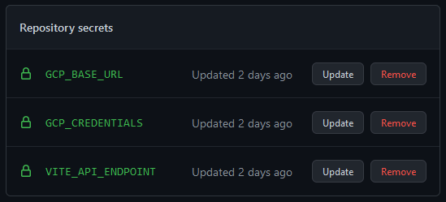

# .NET6 / MongoDB / React / Vite / MUI / Valtio

This project demonstrates the usage of:

- Web
  - React
  - Vite
  - MUI
  - Valtio
- API
  - .NET 6
  - MongoDB

The code will run on Windows, MacOS, Linux, and ARM architectures; you can work with it with only VS Code (and probably works with JetBrains Rider).

Get the .NET SDK for Mac, Linux, and Windows here: https://dotnet.microsoft.com/en-us/download

Use this as a starting point for your own code.

For .C# development in VS Code, grab the OmniSharp extension.  Grab [at least 1.24.0-beta1](https://github.com/OmniSharp/omnisharp-vscode/releases/tag/v1.24.0-beta1) and install manually as there is a defect in earlier versions which causes an issue with .NET 6 projects.

## Rationale

The key objective of this stack is to fulfill the following:

### Secure Runtime

According to [GitHub's State of the Octoverse Security Report from 2020](https://octoverse.github.com/static/github-octoverse-2020-security-report.pdf), the NPM package ecosystem has:

- The highest number of transitive dependencies [by an order of magnitude]
- The highest percentage of advisories
- The highest number of critical and high advisories
- The highest number of Dependabot alerts
- A lag time of *218 weeks* before a vulnerability is detected and patched

Because of the philosophy of the NPM ecosystem ("Do one thing, do it well"; for example, many projects need to import libraries to simply work with date times because the base JavaScript date/time facilities are so lacking), it means that each project will have dozens if not hundreds or even thousands (not unheard of for mature projects) transitive dependencies that could pose a security threat.  Building any Node project always spits out a list of possible vulnerabilities and upgrades that *should* be addressed but rarely gets addressed by teams for a variety of reasons.

While this is unavoidable for building modern web front-ends, it poses a risk on server applications -- especially when handling sensitive data.  Over time, the cost of maintaining patch state becomes a chore in and of itself.

[Erlang The Movie II: The Sequel](https://www.youtube.com/watch?v=rRbY3TMUcgQ) [puts it best](https://youtu.be/rRbY3TMUcgQ?t=236):

> I like Node.js because as my hero, [Ryan Dahl says it's like coloring with crayons and playing with Duplo blocks](https://news.ycombinator.com/item?id=4310723), but as it turns out it's less like playing with Duplo blocks and more like playing with Slinkies.  Slinkies that get tangled together and impossible to separate.

### Performance

Multiple benchmarks show that .NET Core is now in the same performance tier as Go and Rust in real-world workloads while still being highly accessible and easy to hire for.

- [The Computer Language Benchmarks Game comparing Go vs C# in math heavy computations](https://benchmarksgame-team.pages.debian.net/benchmarksgame/fastest/go-csharpcore.html)
- [TechEmpower Round 20 Benchmarks with ASP.NET Core beating Fiber (Go) and absolutely stomping Node.js and Nest.js](https://www.techempower.com/benchmarks/#section=data-r20&hw=ph&test=composite)
- [Alex Yakunin's article exploring Go vs .NET garbage collection and memory allocation throughput](https://medium.com/servicetitan-engineering/go-vs-c-part-3-compiler-runtime-type-system-modules-and-everything-else-faa423dddb34)
- [Aleksandr Filichkin's benchmarks comparing AWS Lambda performance of various languages](https://filia-aleks.medium.com/aws-lambda-battle-x86-vs-arm-graviton2-perfromance-3581aaef75d9)

[.NET 6 brings additional performance improvements](https://devblogs.microsoft.com/dotnet/performance-improvements-in-net-6/) which will continue to push the boundaries.

While Node, Go, and Rust show better cold-start performance, this is generally a small penalty that is only paid once on the initial startup of a container instance.  It can be optimized for [by using pre-JIT techniques](https://medium.com/@tainguyenbui/optimizing-c-aws-lambda-with-custom-runtime-2f1f69f0431a).  [.NET 7 addresses this with NativeAOT](https://github.com/dotnet/runtime/issues/61231).

The same is true of [using vite](https://dev.to/alvarosaburido/vite-2-a-speed-comparison-in-vue-1f5j).  Vite uses esbuild underneath [and its performance puts webpack out to pasture (at least for dev builds!)](https://developpaper.com/ask-if-you-dont-understand-where-is-esbuild/).

### Easy(-ish) to Transition

[Both C# and TypeScript were designed by Anders Hejlsberg of Microsoft](https://en.wikipedia.org/wiki/Anders_Hejlsberg).  And while TypeScript offers a wide degree of freedom with how one uses it, developers familiar with TypeScript's features like generics, interfaces, and inheritance will have a very short ramp to C# compared to Go or Rust.

TypeScript:

```ts
interface IRepository<T> {
    Save(entity: T): void;

    List(): T[];
}

class Person {
    public firstName: string;
    public lastName: string;

    constructor(firstName: string, lastName: string) {
        this.firstName = firstName;
        this.lastName = lastName;
    }
}

class PersonRepository implements IRepository<Person> {
    public Save(instance: Person): void {
        // Do save here...
    }

    List = (): Person[] => [];

    public static Init(): void {
        var person = new Person("Amy", "Lee");
        var repository = new PersonRepository();

        repository.Save(person);
    }
}
```

C#

```csharp
interface IRepository<T> {
    void Save(T entity);

    T[] List();
}

class Person {
    public string FirstName;
    public string LastName;

    public Person(string firstName, string lastName) {
        this.FirstName = firstName;
        this.LastName = lastName;
    }
}

class PersonRepository : IRepository<Person> {
    public void Save(Person instance) {
        // Do save here...
    }

    public Person[] List() => new Person[] {};

    public static void Init() {
        var person = new Person("Amy", "Lee");
        var repository = new PersonRepository();

        repository.Save(person);
    }
}
```

While it's true that JavaScript and TypeScript have a spectrum of styles from very functional to semi-object-oriented, C#; JavaScript; and TypeScript do share a lot of syntactic and stylistic similarities as well as general functionality because the .NET runtime has come to support functional programming languages (F#) over the years.

The TypeScript example above could obviously be far more functional in style as well:

```ts
interface IRepository<T> {
    save: (entity: T) => void,
    items: () => T[]
}

interface Person {
    firstName: string,
    lastName: string
}

const createPersonRepository = (): IRepository<Person> => {
    const persons: Person[] = [];
    return {
        items: () => persons.slice(),
        save: (p: Person) => { persons.push(p); }
    };
};
```

But if you are already planning on adopting stronger typing on the server, it seems like a good opportunity to simply step up to C# instead.

.NET's LINQ facilities provide a functional approach using lambda closures that many JavaScript and TypeScript developers are already familiar with.

```ts
// TypeScript/JavaScript
const names = people.map(p => p.firstName);
const chens = people.filter(p => p.lastName.toLowerCase() === "chen");
const smiths = people.map(p => p.firstName)
                     .filter(n => n.toLowerCase() === "smith");
```

```cs
// C#
var names = people.Select(p => p.FirstName);
var chens = people.Where(p => p.LastName.ToLowerInvariant() == "chen");
var smiths = people.Select(p => p.FirstName)
                   .Where(n => n.ToLowerInvariant() == "smith");
```

Compare [LINQ's standard operators](https://docs.microsoft.com/en-us/dotnet/csharp/programming-guide/concepts/linq/classification-of-standard-query-operators-by-manner-of-execution#classification-table) with [JavaScript arrays](https://developer.mozilla.org/en-US/docs/Web/JavaScript/Reference/Global_Objects/Array).

Like JavaScript, functions can be passed as arguments in C#:

```cs
public static bool Filter(string name)
{
    return name.StartsWith('T');
}

var names = new [] { "Tom", "James", "Anish", "Michelle", "Terry" };

var filtered = names.Where(Filter); // Pass the filter function as an argument

// Or chain the commands.
names.Where(Filter)
    .ToList()
    .ForEach(Console.WriteLine);
```

Async/Await for *asynchronous programming* in C# and JavaScript are also very similar:

```js
// JavaScript
async function doSomething() { } // Async method.
await doSomething(); // Invoke async method.
```

And C#:

```cs
// C#
async Task DoSomething() { } // Async method.
await DoSomething(); // Invoke async method.
```

[C# asynchronous programming](https://docs.microsoft.com/en-us/dotnet/csharp/async) makes use of the [Task class](https://docs.microsoft.com/en-us/dotnet/standard/async-in-depth) and, like JavaScript, implements the [Promise Model of Concurrency](https://en.wikipedia.org/wiki/Futures_and_promises).

On top of this, [.NET's Task Parallel Library](https://docs.microsoft.com/en-us/dotnet/standard/parallel-programming/task-parallel-library-tpl) makes concurrent programming very accessible to maximize your compute resources for workloads that can be run in parallel:

```cs
Parallel.For(0, largeList.Length, (i, state) => {
    // Parallel compute; be sure you know how to handle thread safety!
});
```

C#'s congruence to TypeScript and JavaScript makes a strong case for adopting it on the server, especially when the goal is to achieve a secure, high performance runtime.

There's a whole slew of [functional techniques](https://softchris.github.io/pages/dotnet-csharp-news.html#property-pattern) including:

- [Pattern matching](https://docs.microsoft.com/en-us/dotnet/csharp/fundamentals/functional/pattern-matching)
- [Tuple types](https://docs.microsoft.com/en-us/dotnet/csharp/language-reference/builtin-types/value-tuples)
- [Deconstructing](https://docs.microsoft.com/en-us/dotnet/csharp/fundamentals/functional/deconstruct)

### Productivity with .NET MongoDB Driver LINQ

At scale, teams *need* to have a strongly typed data model in the API.  Starting from a loosely/untyped data model in the early stages of a project can be critical for speed, but as the team grows, as customers seek APIs for integration, as the complexity of the domain space increases, the lack of a strongly-typed data model at the API is a bottleneck for growth and leads to slapdash code, high duplication, and high rates of defects that eventually start to hamper growth.

Whether TypeScript or C# or Go, having a typed data model and well-defined API is a long term necessity for any project that needs to scale as the number of individuals working in the codebase increases and as downstream consumers (other teams, customers, partners) increases.

If you are using MongoDB, the LINQ implementation in the .NET MongoDB driver is a huge productivity boost and provides a strongly typed query mechanism (given an application layer data model).

- [LINQ](https://mongodb.github.io/mongo-csharp-driver/2.14/reference/driver/crud/linq/)
- [Object Mapping](https://mongodb.github.io/mongo-csharp-driver/2.14/reference/bson/mapping/#the-id-member)

Given this model:

```csharp
class Person
{
    public string Name { get; set; }
    public int Age { get; set; }
    public IEnumerable<Pet> Pets { get; set; }
    public int[] FavoriteNumbers { get; set; }
    public HashSet<string> FavoriteNames { get; set; }
    public DateTime CreatedAtUtc { get; set; }
}

class Pet
{
    public string Name { get; set; }
}
```

We can write strongly typed queries like this:

```csharp
var query = from p in collection.AsQueryable()
            where p.Age > 21
            select new { p.Name, p.Age };

// or, using method syntax

var query = collection.AsQueryable()
    .Where(p => p.Age > 21)
    .Select(p => new { p.Name, p.Age });
```

No guessing what the schema is in the database.

### Productivity with OpenAPI TypeScript Client Generation

Like my earlier project [dotnet6-openapi](https://github.com/CharlieDigital/dotnet6-openapi), this project demonstrates generation of front-end TypeScript clients using the OpenAPI specification.

The project includes the Swagger middleware for .NET that produces schema documentation:



Every time the .NET project is built, it generates a new OpenAPI schema output which can be used to generate a client for the React front-end. The TypeScript front-end even includes the comments from the server side.

```ts
// web/src/services/models/Company.ts

/**
 * Models a Company entity.
 */
export type Company = {
    id?: string | null;
    label?: string | null;
    /**
     * The address of the company.
     */
    address?: string | null;
    /**
     * The URL of the website for the given company.
     */
    webUrl?: string | null;
}
```

This provides a contract-based development experience that increases productivity by taking the guesswork out of calling APIs.

Once the schema is generated, running:

```
cd web
yarn run codegen
```

Will re-generate the client TypeScript bindings.  Any schema changes will cause build time errors.

### "Magically Simple" React State with Valtio

Daishi Kato, author of valtio, [describes the decision tree for selecting it as "magically simple"](https://twitter.com/dai_shi/status/1348257768130560008?s=20).

Indeed, its use of a proxy-based state model feels more natural in JavaScript compared to the immutable state model of Redux.

## Getting Started

This repo builds up on earlier work in my other projects:

- [react-valtio-example](https://github.com/CharlieDigital/react-valtio-example)
- [dotnet6-openapi](https://github.com/CharlieDigital/dotnet6-openapi)

### Running the API

To run the API, use the following commands:

```
cd api
dotnet run
```

Or

```
cd api
dotnet watch
```

This latter one will watch for changes and automatically rebuild the solution.  It will also launch the UI for the swagger endpoint at: `https://localhost:7293/swagger/index.html`.

### Running the Front-End

To run the front-end, use the following commands:

```
cd web
yarn                # Pull the dependencies
yarn run codegen    # Generate the client code; will fail if server is already running
yarn run dev        # Starts the server.
```

The UI is accessible at `http://localhost:3000` by default.

### Testing the API

To test the API, use the following CURL commands:

```bash
curl --location --request POST 'http://localhost:5009/api/company/add' --header 'Content-Type: application/json' --data-raw '{ "Id": "", "Label": "Test" }'
curl --location --request GET 'http://localhost:5009/api/company/61cf5f0b414b44c2eb8c6f8c'
curl --location --request DELETE 'http://localhost:5009/api/company/delete/61cf5f0b414b44c2eb8c6f8c'
```

```powershell
$headers = New-Object "System.Collections.Generic.Dictionary[[String],[String]]"
$headers.Add("Content-Type", "application/json")

$body = "{ `"Id`": `"`", `"Label`": `"Test`" }"

$response = Invoke-RestMethod 'http://localhost:5009/api/company/add' -Method 'POST' -Headers $headers -Body $body
$response = Invoke-RestMethod 'http://localhost:5009/api/company/61cf5f0b414b44c2eb8c6f8c' -Method 'GET' -Headers $headers
$response = Invoke-RestMethod 'http://localhost:5009/api/company/delete/61cf5f0b414b44c2eb8c6f8c' -Method 'DELETE' -Headers $headers
```

## Adding Tests

The project includes setup of two types of tests:

- **API tests** - these test the back-end of the application.
- **End-to-end tests (E2E)** - these test the end-to-end behavior of the application.

With these two sets of tests, it's up to you decide if you still want to unit test your front-end.  Generally, the E2E is more "valuable" since it tests the full stack and behavior of your application but if poorly designed, can take too long to run compared to true unit tests.

On the flip side, front-end unit tests depend on mocking and can produce false positives (tests that pass with mocks, but not with real-world data).  In general, I recommend teams go for the E2E tests because Playwright is *fast* and it tests the "real" application.  Additionally, well designed E2E tests can be pointed to any environment in the future.

### Core API Tests

The API tests are used to test the core data access components.  This is often the most critical part of the application.

Some may consider this an integration test rather than a true unit test since the example tests the repository and requires a running instance of MongoDB.

In any case, it allows you to test your data access logic and queries to ensure that they are correct.

To add the tests, run:

```
mkdir tests
cd tests
dotnet new mstest
dotnet add reference ../api/Api.csproj
```

To get the intellisense to work correctly, we'll need to add a solution file:

```
cd ../
dotnet new sln
```

Then use the `dotnet sln` command (see [here](https://docs.microsoft.com/en-us/dotnet/core/tools/dotnet-sln)):

```
dotnet sln add api
dotnet sln add tests
```

Finally, point OmniSharp to the `.sln` file by typing `CTRL+SHIFT+P` and then `OmniSharp: Select Project`.

To run the tests:

```
cd tests/api
dotnet test                                     # Run the test normally
dotnet test -l "console;verbosity=detailed"     # Run the test and see trace messages
dotnet test -l:junit                            # Run the test with JUnit XML output
```

Tip: see the `.vscode/settings.json` file to see the setup for the test explorer test resolution.

This can be integrated into [GitHub Actions](https://docs.microsoft.com/en-us/dotnet/devops/dotnet-test-github-action).

For JUnit output, the [JUnit.TestLogger](https://github.com/spekt/junit.testlogger) package has been added.  This primarily supports CI/CD pipelines.

### E2E Tests with Playwright

The end-to-end tests have been configured to use [Playwright](https://playwright.dev/).

It can be run on your local or in a CI/CD pipeline in headless mode.

To run the tests:

```
cd tests/e2e
npm run test
```

Playwright has great tooling including:

- [Inspector](https://playwright.dev/docs/inspector)
- [Trace Viewer](https://playwright.dev/docs/trace-viewer)
- [Test Generator](https://playwright.dev/docs/codegen)

Unlike Cypress, it [supports multiple browsers](https://playwright.dev/docs/browsers) giving you great coverage for your userbase.  It also handles multiple tabs and windows using [BrowserContext](https://playwright.dev/docs/api/class-browsercontext);
## Logging

[Serilog](https://serilog.net/) has been injected in `Program.cs`.

The reason to consider Serilog is that it provides [many different sinks](https://github.com/serilog/serilog/wiki/Provided-Sinks) which can be written to simultaneously for comprehensive logging.

The [structured log output](https://github.com/serilog/serilog/wiki/Structured-Data) allows better data representation in the log output.

## Real Time

To add real time interactions to this, the easiest path is to incorporate [SignalR](https://docs.microsoft.com/en-us/aspnet/core/signalr/hubs?view=aspnetcore-6.0).

In production, you're better off using Azure SignalR as this provides a low-cost, highly scalable web-sockets as a service capability.

Use the local hub for development and switch to Azure SignalR in production.

## Operationalizing

The solution can be operationalized into Google Cloud Run (back-end) and Google Storage Buckets (front-end).



It is also possible to do this with other cloud providers' equivalent service.

### Google Cloud Run (GCR)

In GCR, the easiest way to get started is to connect your GCR project to your GitHub repo and mirror the repo.

In the runtime, you'll need to override the configuration by adding two environment variables (or secrets):

|Environment Variable|Description|
|---|---|
|`MongoDbConnectionSettings__ConnectionString`|Overrides the connection string in the `appsettings.json` file.|
|`MongoDbConnectionSettings__DatabaseName`|Overrides the database name in the `appsettings.json` file.|

If you are running this with a free Mongo Atlas account, don't forget to allow all IP addresses (pick a strong password!) since the GCR instance does not have a static IP without a VPC in Google Cloud.

Both AWS and Azure offer similar capabilities, though none are as mature of Google Cloud Run at the moment:

- [Amazon AWS App Runner](https://aws.amazon.com/apprunner/) - currently only supports Node and Python
- [Azure Container Apps](https://azure.microsoft.com/en-us/services/container-apps/) - currently in preview, but supports the excellent [Dapr](https://dapr.io/) runtime.

### Google Cloud Storage Buckets and Static Websites

Modern web applications do not need to have a hosted web server; front-ends can instead be served directly from cloud storage buckets.  This has multiple benefits:

1. It is cheap, incredibly scalable, and highly performant; even more so with a CDN in front of the static output of your build process.
2. It reduces the scope of systems management by removing Yet Another Server from your infrastructure.
3. It integrates really nicely with GitHub Actions or other CI/CD automation for pushing builds directly from source.

In this project, you can see how this is done via the GitHub Action in `.github/workflows/upload-gcp-web.yml`.

This GH Action kicks off whenever there is a change to a file in the `/web` directory and automatically builds the front-end project and pushes it into a Google Cloud Storage Bucket.

The Action requires three inputs:

|Parameter|Description|
|---|---|
|`VITE_API_ENDPOINT`|The API endpoint in Google Cloud Run that the front-end will connect to.|
|`GCP_CREDENTIALS`|The JSON formatted credentials of the service account to use when pushing the files into the Storage Bucket from GitHub.|
|`GCP_BASE_URL`|The base URL of the static website bucket that is injected at build time.|

These need to be configured in the GitHub Secrets for your project:



Both AWS and Azure offer similar capabilities:

- [Amazon AWS S3 Static Websites](https://docs.aws.amazon.com/AmazonS3/latest/userguide/WebsiteHosting.html) - has great integration with Cloudfront for CDN
- [Azure Storage Static Websites](https://docs.microsoft.com/en-us/azure/storage/blobs/storage-blob-static-website) - very easy to implement, has great integration with Functions, and also has CDN integration

One note with the Google Cloud Storage Buckets is that there is a default 3600 second cache for all artifacts uploaded into Google Cloud Storage.  This can be problematic because even if you manually set to the `Cache-Control` to `no-store`, every publish will overwrite the metadata and set it back to the default 3600.  When this occurs, your front-end does not update and there is no mechanism to force it to do so.  The workaround is to have a proxy or CDN in front of the app that will generate a random URL token to force a fresh read and then cache at the proxy or CDN instead of directly in Google Storage (neither AWS nor Azure behave the same way; both require explicit activation of caching or usage of the CDN).

## Resources

- [.NET Core Web API MongoDB Tutorial](https://docs.microsoft.com/en-us/aspnet/core/tutorials/first-mongo-app?view=aspnetcore-6.0&tabs=visual-studio-code)
- [.NET Core Web API Attribute Routing](https://docs.microsoft.com/en-us/aspnet/web-api/overview/web-api-routing-and-actions/attribute-routing-in-web-api-2)
- [.NET Core Model Binding](https://docs.microsoft.com/en-us/aspnet/core/mvc/models/model-binding?view=aspnetcore-6.0#sources)
- [.NET Core Runtime Configuration](https://docs.microsoft.com/en-us/aspnet/core/fundamentals/configuration/?view=aspnetcore-6.0#evcp)
- [MongoDB .NET Driver Documentation](http://mongodb.github.io/mongo-csharp-driver/)
  - [LINQ](https://mongodb.github.io/mongo-csharp-driver/2.14/reference/driver/crud/linq/)
  - [Advanced Class Mapping](http://mongodb.github.io/mongo-csharp-driver/2.10/reference/bson/mapping/)
- [Google Cloud Run - Static IP Address](https://cloud.google.com/run/docs/configuring/static-outbound-ip)
- [Google Cloud Run Environment Variables](https://cloud.google.com/run/docs/configuring/environment-variables)
